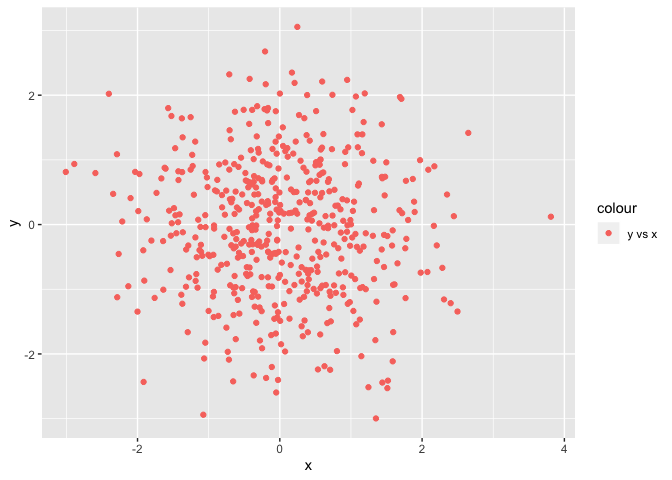
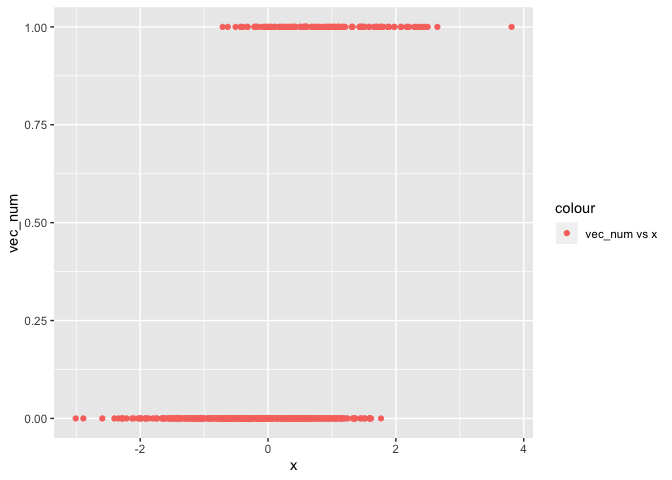
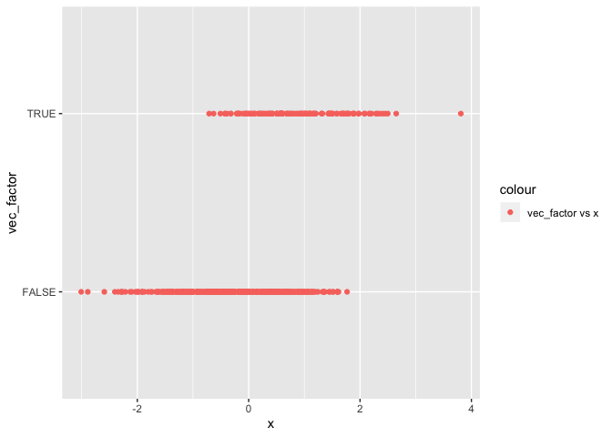

p8105\_hw1\_yl4358
================
YI LIU
9/17/2019

# Problem 1

``` r
library(tidyverse)
```

    ## ── Attaching packages ────────────────────────────────────────────── tidyverse 1.2.1 ──

    ## ✔ ggplot2 3.2.1     ✔ purrr   0.3.2
    ## ✔ tibble  2.1.3     ✔ dplyr   0.8.3
    ## ✔ tidyr   0.8.3     ✔ stringr 1.4.0
    ## ✔ readr   1.3.1     ✔ forcats 0.4.0

    ## ── Conflicts ───────────────────────────────────────────────── tidyverse_conflicts() ──
    ## ✖ dplyr::filter() masks stats::filter()
    ## ✖ dplyr::lag()    masks stats::lag()

``` r
set.seed(1)
first_df = tibble(
  sample = rnorm(8),
  vec_log = sample > 0,
  vec_char = c("My", "name", "is", "YI", "LIU", "and", "study", "biostatistics"),
  vec_factor = factor(c("high", "medium", "low", "high", "medium", "low", "low", "low"))
)
```

The mean of the sample is 0.1314544

The mean of vec\_log is 0.625

We cannot take the mean of character vector and factor
    vector.

``` r
as.numeric(pull(first_df, vec_log)) * pull(first_df, sample)
```

    ## [1] 0.0000000 0.1836433 0.0000000 1.5952808 0.3295078 0.0000000 0.4874291
    ## [8] 0.7383247

``` r
as.factor(pull(first_df, vec_log)) * pull(first_df, sample)
```

    ## Warning in Ops.factor(as.factor(pull(first_df, vec_log)), pull(first_df, :
    ## '*' not meaningful for factors

    ## [1] NA NA NA NA NA NA NA NA

``` r
as.numeric(as.factor(pull(first_df, vec_log))) * pull(first_df, sample)
```

    ## [1] -0.6264538  0.3672866 -0.8356286  3.1905616  0.6590155 -0.8204684
    ## [7]  0.9748581  1.4766494

# Problem 2

``` r
second_df = tibble(
  x = rnorm(500),
  y = rnorm(500),
  vec_log2 = (x + y) > 1,
  vec_num = as.numeric(vec_log2),
  vec_factor = as.factor(vec_log2)
)
```

  - The dataset has 500 rows and 5 columns

  - The mean, median and standard deviation of x is 0.0196843,
    -0.0384371, 1.0137029

  - The proportion of cases for which x + y \> 1 is
0.252

<!-- end list -->

``` r
ggplot(second_df, aes(x = x, y = y, color = "y vs x")) + geom_point()
```

<!-- -->

``` r
ggsave("hw1_plot1_yl4358.pdf")
```

    ## Saving 7 x 5 in image

``` r
ggplot(second_df, aes(x = x, y = vec_num, color = "vec_num vs x")) + geom_point()
```

<!-- -->

``` r
ggplot(second_df, aes(x = x, y = vec_factor, color = "vec_factor vs x")) + geom_point()
```

<!-- -->
